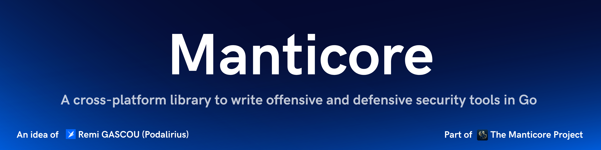

<p align="center">
      Manticore is a framework for working with Windows network protocols (SMB, LDAP, DCE/RPC, and more), cryptography, and authentication, designed for building cross-platform security tooling.
      <br>
      <a href="https://github.com/TheManticoreProject/Manticore/actions/workflows/unit_tests.yaml" title="Build"></a>
      
      
      <a href="https://twitter.com/intent/follow?screen_name=podalirius_" title="Follow"></a>
      <a href="https://www.youtube.com/c/Podalirius_?sub_confirmation=1" title="Subscribe"></a>
      <br>
</p>

## Features

- [x] **Cross-Platform Support**: Works on Windows, Linux, and macOS — no Windows API dependency.
- [x] **Authentication**: NTLM (v1/v2), SPNEGO/GSSAPI, LDAP bind, and a native Kerberos v5 stack — AS/TGS exchanges, PKINIT, FAST, S4U (S4U2self/S4U2proxy), U2U, AS-REP roasting and Kerberoasting, golden/silver/diamond/sapphire ticket forging, UnPAC-the-hash, and keytab/ccache/kirbi credential I/O.
- [x] **Network Protocols**: SMB 1.0 (CIFS) and SMB 2.0, a full DCE/RPC stack (NDR, EPM, `ncacn_ip_tcp`/`ncacn_np`/`ncacn_http` transports) exposing LSARPC, SAMR, SRVSVC, SVCCTL, DRSUAPI and WINREG, plus LDAP, LLMNR and NetBIOS name services.
- [x] **Cryptography**: [aescts](crypto/aescts/), [cmac](crypto/cmac/), [dcc](crypto/dcc/), [dcc2](crypto/dcc2/), [gppp](crypto/gppp/), [lm](crypto/lm/), [md4](crypto/md4/), [nfold](crypto/nfold/), [nt](crypto/nt/), [ntlmv1](crypto/ntlmv1/), [ntlmv2](crypto/ntlmv2/), [pkcs7](crypto/pkcs7/), [rc4](crypto/rc4/), [spnego](crypto/spnego/), [uuid](crypto/uuid/)
- [x] **Windows Internals**: Offline NTDS.dit secret extraction (ESE/JET parser + PEK decryption), REGF registry hive read/write, Active Directory replication metadata (`DS_REPL_*`), KeyCredentialLink, and CNG (bcrypt) key blobs.
- [x] **Extensible Architecture**: Easily add new modules and functionality.

## Installation

To use this framework you can either download the latest release from the [GitHub release page](https://github.com/TheManticoreProject/Manticore/releases) or add it to your project with the following `go` command:

```bash
go get github.com/TheManticoreProject/Manticore@latest
```

## Roadmap

Legend: :white_check_mark: implemented &nbsp;·&nbsp; :construction: partial / in progress &nbsp;·&nbsp; :x: not yet implemented

- **Network**
  - SMB
    - SMB 1.0 (CIFS) :white_check_mark:
    - SMB 2.0 :construction:
    - SMB 2.1 :x:
    - SMB 3.0 :x:
    - SMB 3.0.2 :x:
    - SMB 3.1.1 :x:
  - DCE/RPC
    - Core (PDU, NDR encoding/decoding, EPM) :white_check_mark:
    - Transports
      - `ncacn_ip_tcp` :white_check_mark:
      - `ncacn_np` (named pipes) :white_check_mark:
      - `ncacn_http` :white_check_mark:
    - Interfaces
      - LSARPC (MS-LSAD / MS-LSAT) :white_check_mark:
      - SAMR (MS-SAMR) :white_check_mark:
      - SRVSVC (MS-SRVS) :white_check_mark:
      - SVCCTL (MS-SCMR) :white_check_mark:
      - DRSUAPI (MS-DRSR) :white_check_mark:
      - WINREG (MS-RRP) :construction:
      - EFSRPC (MS-EFSR) :construction:
      - EPM (endpoint mapper) :construction:
      - DSAOP (MS-DSSP) :x:
  - LDAP :construction:
  - Kerberos v5 :white_check_mark:
    - AS-REQ / TGS-REQ client (TGT, service tickets, referrals, renew, postdate) :white_check_mark:
    - PKINIT (RFC 4556) :white_check_mark:
    - FAST / armoring (RFC 6113), incl. FAST-TGS :white_check_mark:
    - S4U2self / S4U2proxy (MS-SFU) :white_check_mark:
    - User-to-user (U2U) :white_check_mark:
    - AS-REP roasting & Kerberoasting (hashcat / john output) :white_check_mark:
    - Golden / silver / diamond / sapphire ticket forging :white_check_mark:
    - UnPAC-the-hash & PAC build / parse :white_check_mark:
    - keytab / ccache / kirbi credential I/O :white_check_mark:
    - GSSAPI acceptor, per-message tokens & delegation :white_check_mark:
  - GSSAPI / SPNEGO (NTLM) :white_check_mark:
  - LLMNR :white_check_mark:
  - NetBIOS
    - NBNS (name service) :white_check_mark:
    - NBT (NetBIOS over TCP) :construction:
    - NBF (NetBIOS frames) :x:
  - DNS :x:
  - Raw TCP / IP :x:
- **Cryptography**
  - MD4 / NT / LM hashes :white_check_mark:
  - DCC / DCC2 :white_check_mark:
  - NTLMv1 / NTLMv2 :white_check_mark:
  - RC4 :white_check_mark:
  - AES-CTS (RFC 3962) :white_check_mark:
  - CMAC :white_check_mark:
  - N-Fold (RFC 3961) :white_check_mark:
  - PKCS#7 padding :white_check_mark:
  - GPPP (Group Policy Preferences) :white_check_mark:
  - UUID (v1–v8) :white_check_mark:
  - Kerberos crypto (AES-CTS-HMAC-SHA1 RFC 3962, AES-CTS-HMAC-SHA2 RFC 8009, RC4-HMAC RFC 4757) :white_check_mark:
- **Windows**
  - Registry
    - REGF hive parsing (read) :white_check_mark:
    - REGF hive writing :white_check_mark:
    - `.reg` file encode/decode :white_check_mark:
  - Database
    - ESE / JET Blue reader :white_check_mark:
    - NTDS.dit offline parsing + secret decryption :white_check_mark:
  - Active Directory
    - Replication metadata (`DS_REPL_*`) :white_check_mark:
    - KeyCredentialLink :white_check_mark:
    - Service Principal Names (SPN) :white_check_mark:
  - Security descriptors (via winacl) :white_check_mark:
  - CNG bcrypt key blobs (RSA / ECC / DSA) :white_check_mark:
  - MS-DTYP data types :construction:
  - Filesystem info classes (FSCC) :construction:
- **Encoding**
  - ASCII :white_check_mark:
  - UTF-16LE :white_check_mark:
  - EBCDIC (cp037, cp500) :white_check_mark:

## Contributing

Pull requests are welcome. Feel free to open an issue if you want to add other features.

## Credits
  - [Remi GASCOU (Podalirius)](https://github.com/p0dalirius) for the creation of the [Manticore](https://github.com/TheManticoreProject/Manticore) project.
