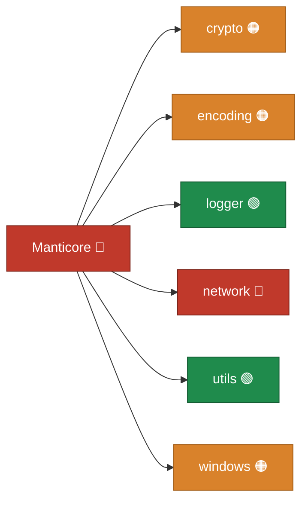

<p align="center">
      Manticore is a framework for working with Windows network protocols (SMB, LDAP, DCE/RPC, and more), cryptography, and authentication, designed for building cross-platform security tooling.
      <br>
      <a href="https://github.com/TheManticoreProject/Manticore/actions/workflows/unit_tests.yaml" title="Build"></a>
      
      
      <a href="https://twitter.com/intent/follow?screen_name=podalirius_" title="Follow"></a>
      <a href="https://www.youtube.com/c/Podalirius_?sub_confirmation=1" title="Subscribe"></a>
      <br>
</p>

## Features

- [x] **Cross-Platform Support**: Works on Windows, Linux, and macOS — no Windows API dependency.
- [x] **Authentication**: NTLM (v1/v2), SPNEGO/GSSAPI, LDAP bind, and a native Kerberos v5 stack — AS/TGS exchanges, PKINIT, FAST, S4U (S4U2self/S4U2proxy), U2U, AS-REP roasting and Kerberoasting, golden/silver/diamond/sapphire ticket forging, UnPAC-the-hash, and keytab/ccache/kirbi credential I/O.
- [x] **Network Protocols**: SMB 1.0 (CIFS) and SMB 2.0, a full DCE/RPC stack (NDR, EPM, `ncacn_ip_tcp`/`ncacn_np`/`ncacn_http` transports) exposing LSARPC, SAMR, SRVSVC, SVCCTL, DRSUAPI and WINREG, plus LDAP, LLMNR and NetBIOS name services.
- [x] **Cryptography**: [aescts](crypto/aescts/), [cmac](crypto/cmac/), [dcc](crypto/dcc/), [dcc2](crypto/dcc2/), [gppp](crypto/gppp/), [lm](crypto/lm/), [md4](crypto/md4/), [nfold](crypto/nfold/), [nt](crypto/nt/), [ntlmv1](crypto/ntlmv1/), [ntlmv2](crypto/ntlmv2/), [pkcs7](crypto/pkcs7/), [rc4](crypto/rc4/), [spnego](crypto/spnego/), [uuid](crypto/uuid/)
- [x] **Windows Internals**: Offline NTDS.dit secret extraction (ESE/JET parser + PEK decryption), REGF registry hive read/write, Active Directory replication metadata (`DS_REPL_*`), KeyCredentialLink, and CNG (bcrypt) key blobs.
- [x] **Extensible Architecture**: Easily add new modules and functionality.

## Installation

To use this framework you can either download the latest release from the [GitHub release page](https://github.com/TheManticoreProject/Manticore/releases) or add it to your project with the following `go` command:

```bash
go get github.com/TheManticoreProject/Manticore@latest
```

## Roadmap

Each module is colored by advancement state — 🟢 implemented & tested · 🟠 partial / in progress · 🔴 not yet implemented — where a **parent inherits the worst color of its submodules**. The graph below mirrors the package tree on disk; this shows the top level only.



See **[docs/roadmap.md](docs/roadmap.md)** for the full module-by-module graph covering every package on the filesystem, and [`docs/gen_roadmap_graph.py`](docs/gen_roadmap_graph.py) which regenerates it.

## Contributing

Pull requests are welcome. Feel free to open an issue if you want to add other features.

## Credits
  - Remi GASCOU (Podalirius) ([@p0dalirius](https://github.com/p0dalirius)) for the creation of the [Manticore](https://github.com/TheManticoreProject/Manticore) project.
  - [SecureAuthCorp](https://github.com/SecureAuthCorp) and [Fortra](https://github.com/fortra/) for creating and maintaining [Impacket](https://github.com/fortra/impacket).
